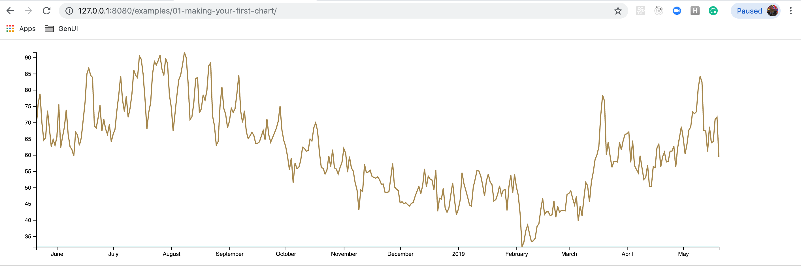
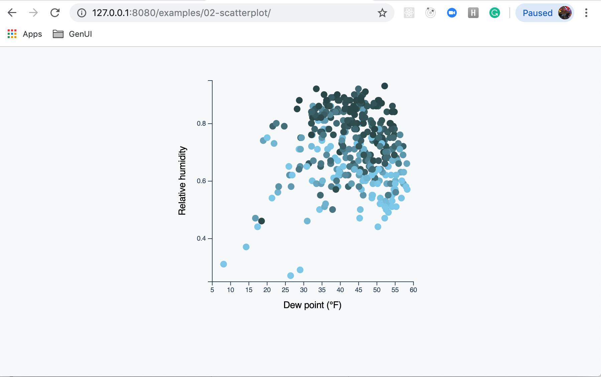
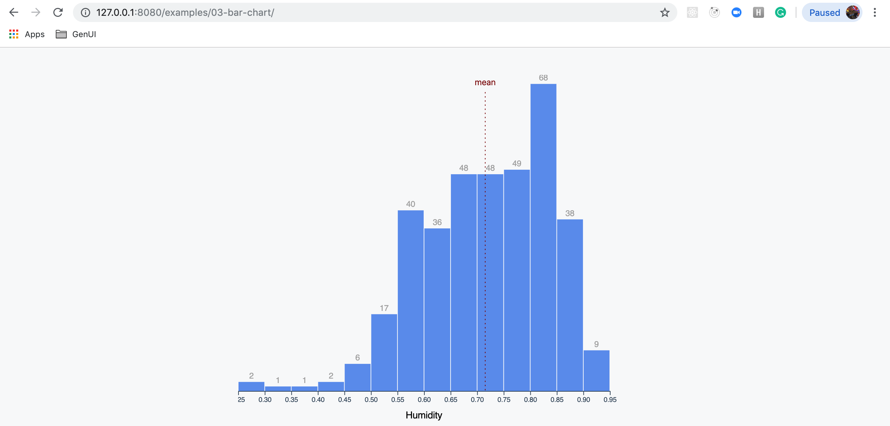
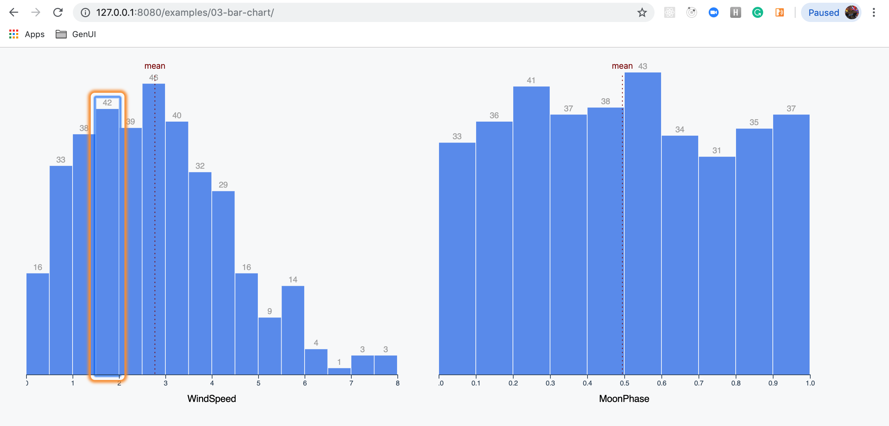

# Welcome

This project was inspired by work from the book [Fullstack D3 and Data Visualization](https://www.fullstack.io/fullstack-d3).

## Example 01: Display the maximum temperature per day in Seattle over the past year

## Example 02: Display a scatterplot comparing relative humidity to the dew point

## Example 03: Display a histogram for humidity levels in Seattle

### Simple histogram

### Generalize our histogram to display graphs for a variety of Seattle weather metrics

### Accessibility enhancements for our histogram charts

Once the user has loaded this example and has a screen reader active, they immediately will hear the page title - “Example oh-three - making a bar chart.”

When they tab into a component, they hear - “Histogram looking at the distribution of ${metric} in Seattle over the past year.”

When they tab into a group of bars, they hear - "Histogram bars. List with sixteen items."

If an item is selected with a tab or by interacting with it directly, the user will hear something like “There were thirty-three days between point five and one WindSpeed levels.”

