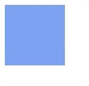
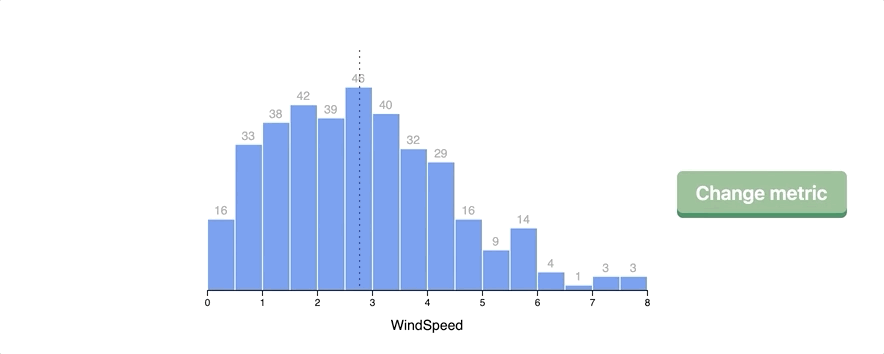
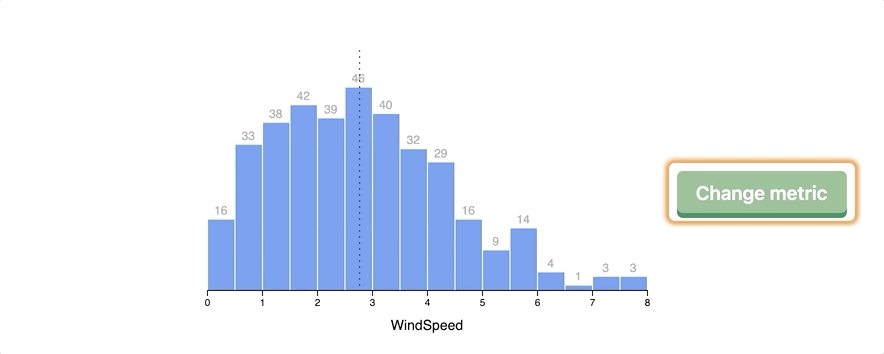
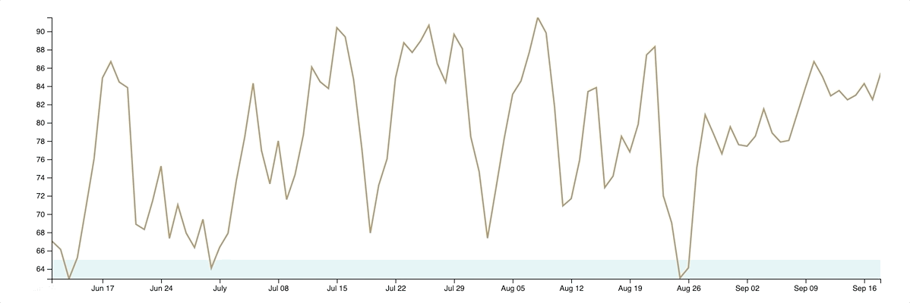
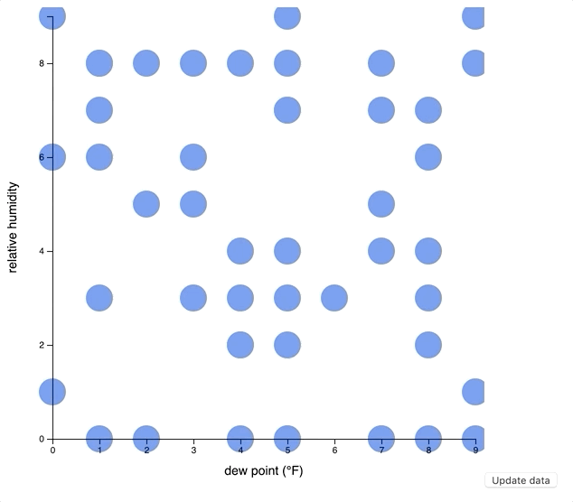
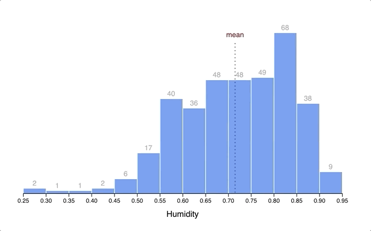
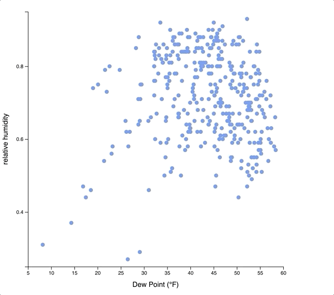
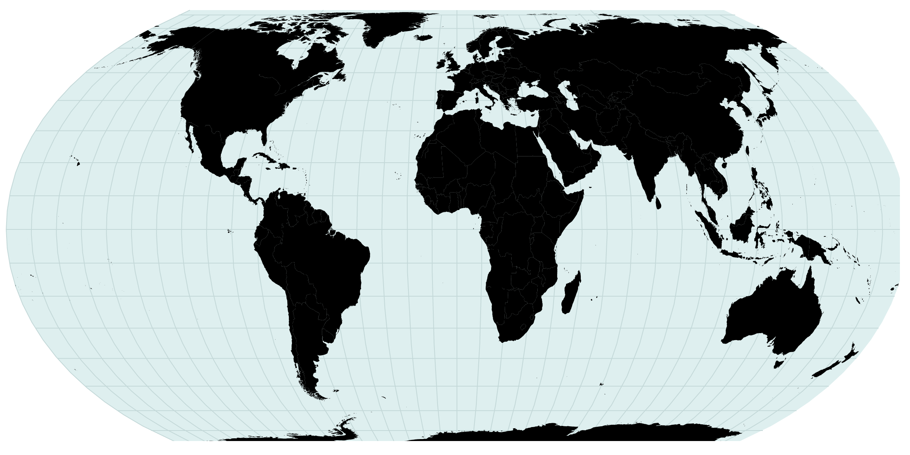

# Welcome

This project was inspired by work from the book [Fullstack D3 and Data Visualization](https://www.fullstack.io/fullstack-d3).

## Example 01: Display the maximum temperature per day in Seattle over the past year


## Example 02: Display a scatterplot comparing relative humidity to the dew point


## Example 03: Display a histogram for humidity levels in Seattle

### Simple histogram


### Generalize our histogram to display graphs for a variety of Seattle weather metrics


### Accessibility enhancements for our histogram charts

Once the user has loaded this example and has a screen reader active, they immediately will hear the page title - “Example oh-three - making a bar chart.”

When they tab into a component, they hear - “Histogram looking at the distribution of ${metric} in Seattle over the past year.”


When they tab into a group of bars, they hear - "Histogram bars. List with sixteen items."

If an item is selected with a tab or by interacting with it directly, the user will hear something like “There were thirty-three days between point five and one WindSpeed levels.”


## Example 04: Animations and Transitions

### Demo 1: SVG animate

Quick demo on using the `<animate>` element within an SVG. This is a crude animation technique, and requires static start and end details for the target SVG.


### Demo 2: CSS transition playground

Simple demo to animate an SVG asset with CSS transitions.



### Demo 3a: Draw bars with CSS transition

Example using CSS transitions for animating our bars and the mean line.



### Demo 3b: Draw bars with D3 transition

This example demonstrates how we can color new bars that need to be added to the chart in green as well as color bars in red that are ready to be removed.

One thing that we can do with D3 transitions that we could not do with CSS transitions is smoothly animate our axis and its related tick marks.



### Demo 4: Draw line

This uses a dataset that is constantly updating over time - including applying advanced techniques such as using a `clip-path` to make sure we are not drawing data outside of domain.



### Demo 5: Draw scatter

This example was not in the book, but the code sample was worth incorporating to see how we might look at animating a scatterplot when data is updated.



## Example 05: Interactions

### Demo 1: Events

This example uses D3 to add `mouseenter` and `mouseout` events to SVG elements - and removes them 3 seconds later.


One optimization here was to make sure our rectangles were not left in a hovered state by dispatching a `mouseout` event before removing the event listeners.

### Demo 2: Bars

Adding a tooltip to our histogram bar chart.



### Demo 3: Scatter

Instead of forcing the user to hover on a small target dot for a tooltip, this example employs the use of a [Voronoi diagram](https://en.wikipedia.org/wiki/Voronoi_diagram) to create polygons users can hover over to display the tooltip - as well as drawing a larger dot to emphasize the specific data point being viewed.

Here is an example with the generated [Voronoi diagram](https://en.wikipedia.org/wiki/Voronoi_diagram) visible to the user:


Here is an example with the generated [Voronoi diagram](https://en.wikipedia.org/wiki/Voronoi_diagram) that is not visible to the user:



### Demo 4: Line

Instead of forcing the user to hover on specific points on the line graph, this example draws a transparent `rect` over the entire chart; allowing the user to have a tooltip displayed when they hover anywhere on the graph.


## Example 06: Making a map

### Introduction to GeoJSON

This section starts off with an overview of [GeoJSON](https://tools.ietf.org/html/rfc7946) - a format used to represent geographic structures.

Start off using [Natural Earth](https://www.naturalearthdata.com) - which is a great source for public domain map data. Download the [Admin 0 - Countries](https://www.naturalearthdata.com/downloads/50m-cultural-vectors/50m-admin-0-countries-2/) dataset.

This download will contain various formats. We are interested in the shapefiles - extensions `shp` and `shx`. We can use a tool such as [GDAL](http://trac.osgeo.org/gdal/wiki/DownloadingGdalBinaries) - Geographic Data Abstraction Library - to convert our shapefile into a JSON file.

#### Geographic Data Abstraction Library (GDAL)

##### Installation on macOS

If you're on a computer running macOS Mojave, the first thing you should do is ensure you have the latest `homebrew` installed:

```sh
$ /usr/bin/ruby -e "$(curl -fsSL https://raw.githubusercontent.com/Homebrew/install/master/install)"
```

Next, install gdal. This will take a few minutes to build, so take a moment and treat yourself to a beverage of your choosing:

```sh
$ brew install gdal
```

##### Convert shapefile to JSON

To convert a shapefile to a JSON file containing GeoJSON data:

```sh
$ ogr2ogr -f GeoJSON ./path/to/target.json ./path/to/source.shp
```

In this example, we are going to run the following commands:

```sh
$ cd examples/06-making-a-map/data/
$ ogr2ogr -f GeoJSON ./world-geojson.json ./ne_50m_admin_0_countries.shp
```

### Draw map

I have downloaded a dataset from [The World Bank](https://databank.worldbank.org/data/source/world-development-indicators#) as a CSV file to view the population growth metric - available at `examples/06-making-a-map/data/world_bank_data.csv`

Here is an example of drawing a map using a `geoEqualEarth` projection without any custom fill:


